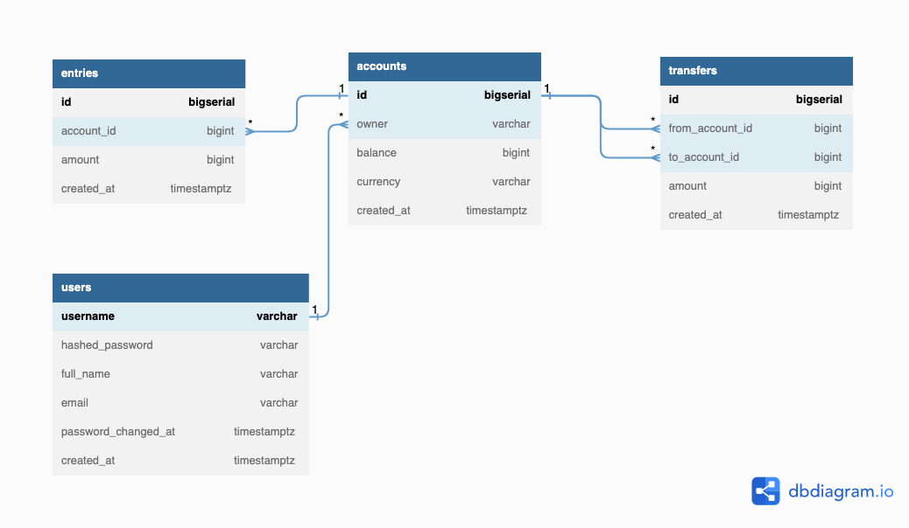

# Bank Server Backend

This project is a backend application for a bank. It includes a database schema, implemented and deployed with PostgreSQL in AWS RDS. The application also includes a set of RESTful HTTP APIs using Gin. The APIs are mocked for robust unit tests, handling errors, authenticating users, and securing the APIs with JWT and PASETO access tokens.

The project also includes a CI/CD pipeline using Github actions and AWS services (ECR, EKS, EC2, Secrets Manager, etc.). Which is shown in the action workflow.

**[updated] The aws EKS service is expensive, so I turn off the EKS cluster and EC2 instance for saving money!**

## Database Schema

The database schema is designed to store information about accounts, transfers, entries and users.

More details in the figure:

## APIs

The application exposes a set of RESTful APIs. Details in [API source code](https://github.com/luyi404/simplebank/tree/main/api)

## Authentication

The APIs are secured with JWT and PASETO access tokens.

## Workflow

The following diagram shows the continuous integration and continuous delivery pipeline:

[github workflow](https://github.com/luyi404/simplebank/tree/main/.github/workflows)
